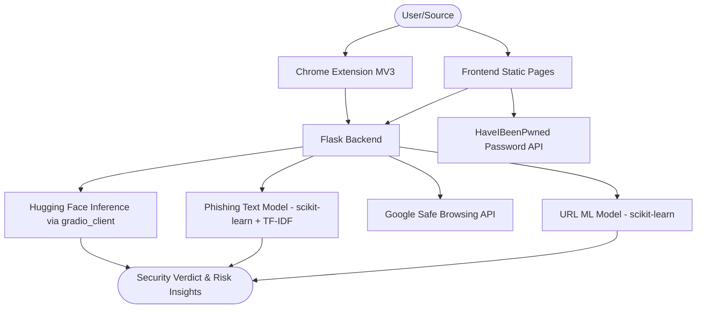

<h1 align="center">
  <a href="https://github.com/athrvas017/Code_Guardians">
    CoC Inheritance 2025
  </a>
  <br>
  NetShield: AI-Powered Shield Against Digital Threats
</h1>

<div align="center">
By Team Code Guardians
</div>
<hr>

<details>
<summary>Table of Contents</summary>

- [Description](#description)
- [Links](#links)
- [Tech Stack](#tech-stack)
- [Progress](#progress)
- [Future Scope](#future-scope)
- [Applications](#applications)
- [Project Setup](#project-setup)
- [Team Members](#team-members)
- [Mentors](#mentors)

</details>

## 📝 Description

NetShield is a comprehensive cybersecurity command center designed to protect users from modern digital threats. It unifies advanced detection engines for identifying AI-generated deepfakes, phishing attacks, and malicious URLs into a single, intuitive platform, bridging the gap between sophisticated AI models and everyday user safety.

## 🔗 Links

- [GitHub Repository](https://github.com/athrvas017/Code_Guardians)
- [Demo Video]([https://drive.google.com/drive/folders/1dVyEsKwROaDJ4tRXqUwdbtWY4HUjXxSL?usp=sharing])
- [Project Screenshots/Drive](https://drive.google.com/drive/folders/1HvrXofSExR4bGeJy7EzlTZEwDSUbz-35)
- [Hosted Website]([https://netshield-67le.onrender.com/])

## 🤖 Tech-Stack

### System Architecture



### Front-end (`frontend/`)
- **HTML5 Pages**: Multi-page interface in `frontend/pages` (index, password toolkit, awareness, AI detection, command analysis).
- **Vanilla JavaScript**: Feature logic in `frontend/js` (password generation, breach check, and utilities).
- **CSS3**: Shared styles in `frontend/css/style.css` and assets in `frontend/assets`.

### Browser Extension (`extension/`)
- **Chrome Extension Manifest V3**: `extension/manifest.json` with service worker architecture.
- **Extension Modules**: Background worker, content scripts, popup UI, and utility scripts under `extension/background`, `extension/content`, `extension/popup`, and `extension/utils`.

### Back-end (`backend/`)
- **Flask (Python 3)**: Central web server and routes in `backend/app.py` with modular services under `backend/services`.
- **Gunicorn + Procfile**: Production serving and deployment support (`backend/gunicorn_config.py`, `backend/Procfile`, `backend/vercel.json`).
- **Environment Configuration**: `python-dotenv` for API keys and runtime configuration.

### ML / AI
- **URL & Phishing Models**: scikit-learn models and vectorizers stored as `.pkl` files in `backend/model` and loaded via `joblib`.
- **Feature/Training Utilities**: Model training scripts and feature engineering in `backend/utils`.
- **AI Image Detection Service**: Hugging Face endpoint integration through `gradio_client` in `backend/services/ai_image_detection.py`.

### External Integrations
- **Google Safe Browsing API**: URL reputation verification in backend safety services.
- **HaveIBeenPwned API (k-Anonymity range API)**: Password breach checks used by the password toolkit.
## 📈 Progress

### Fully Implemented Features

* **AI Image Detection**  
  Detects deepfake and AI-generated images using a ResNet-18 model by analyzing pixel artifacts and frequency patterns.

* **URL Safety Scanner**  
  Uses machine learning-based lexical analysis along with Google Safe Browsing API to identify malicious and phishing websites.

* **Phishing Email Detector**  
  Applies NLP techniques (TF-IDF + Naive Bayes) to detect social engineering attacks and automatically scans embedded links.

* **Dangerous Command Analysis**  
  Identifies harmful shell commands such as file deletion, privilege escalation, and fork bombs, and provides security warnings.

* **Password Toolkit**  
  Generates strong passphrases and checks password leaks securely using k-Anonymity and breach databases.

* **Browser Extension**  
  Real-time Chrome Extension that scans URLs, detects login fields, and provides instant security alerts.


---

### Partially Implemented Features / Work in Progress

* **Database Layer Integration**: Migrating module outputs and user security events to a centralized database for reliable storage, querying, and analytics.
* **Password Manager Module (In Progress)**: Building a secure vault workflow for storing, generating, and auto-filling credentials with encrypted persistence.

## 🔮 Future Scope

* **Advanced Password Manager**: Full-featured encrypted credential vault with breach alerts, password health scoring, and cross-device sync support.
* **URL Model Enhancement**: Improving malicious URL detection with larger datasets, richer feature engineering, and continuous model retraining.
* **AI Image Model Enhancement**: Upgrading deepfake detection with newer architectures, multimodal validation signals, and better robustness against adversarial manipulation.

## 💸 Applications

1. **Consumer Privacy** - Protecting individuals from identity theft and social engineering fraud.
2. **Corporate Security** - Enhancing employee protection against sophisticated Business Email Compromise (BEC).
3. **Media Verification** - Providing tools for journalists and users to verify the authenticity of online imagery.

## 🛠 Project Setup

1. Clone the GitHub repo.
```bash
git clone https://github.com/athrvas017/Code_Guardians.git
```

2. Create and activate a Virtual Environment.
```bash
python -m venv venv
# Windows
.\venv\Scripts\activate
# Linux/macOS
source venv/bin/activate
```

3. Install dependencies.
```bash
pip install -r requirements.txt
```

4. Download ML models and data.
Place the `models` folder and relevant datasets in the `backend/` directory. (Link available in 🔗 Links).

5. Start the Flask application.
```bash
cd backend
python app.py
```

## 👨‍💻 Team Members

* **Athrva Sarade**: [GitHub Profile](https://github.com/athrvas017)
* **Niranjan patil**: [GitHub Profile](https://github.com/niranjanpatil1010)
* **Ajay Payer**: [GitHub Profile](https://github.com/ajaypayer)
* **Om chavarkar**: [GitHub Profile](https://github.com/Blaster1011)


## 👨‍🏫 Mentors

* **[Sarakshi Mamodia]**: [GitHub Profile](https://github.com/smamodia) [LinkedIn](https://www.linkedin.com/in/sarakshi-mamodia-6702682a3?utm_source=share&utm_campaign=share_via&utm_content=profile&utm_medium=ios_app)
* **[Prachi Chavhan]**: [GitHub Profile](https://github.com/Pxchavhan) [LinkedIn](https://www.linkedin.com/in/pchavhan)


